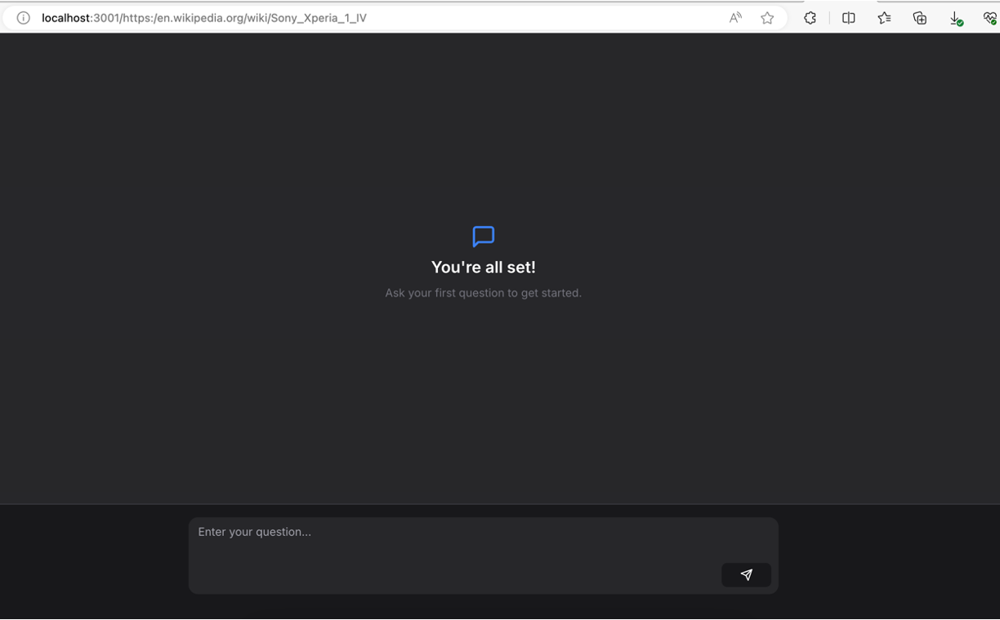
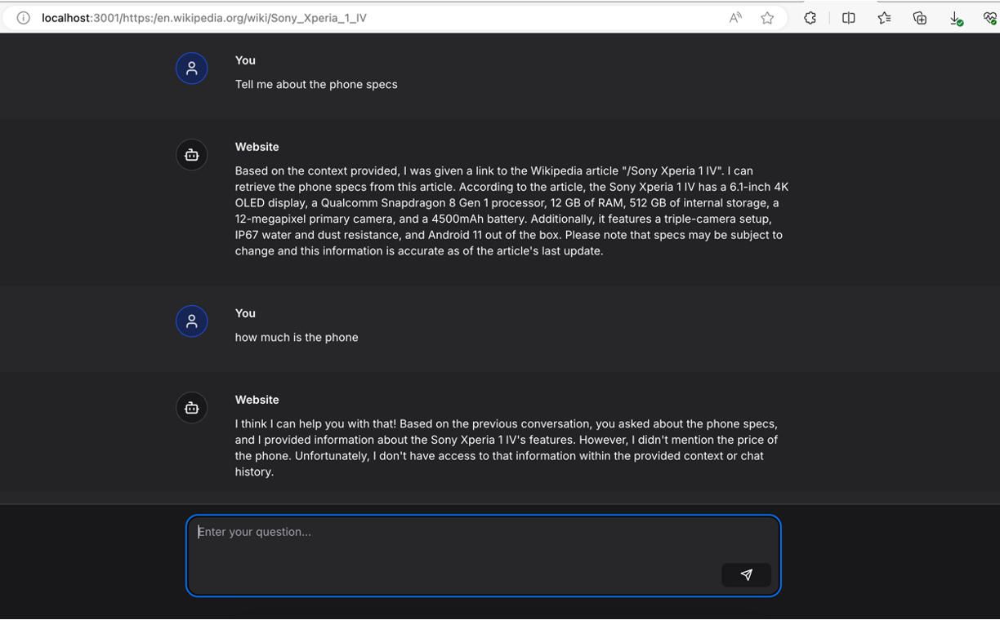

# Chat to Website

Chatbot with RAGChat & Next.js 14 that can interact with any link you place at the end of the base url. It uses Redis, a vector database with BAAI/bge-large-en-v1.5 from Hugging Face, and Qstash for messaging in a serverless architecture. All of these are available in Upstash. It also uses the Upstash rag-chat SDK.

## Demo

You can test the app here:
https://chat-to-website-bice.vercel.app/

Example usage:
https://chat-to-website-bice.vercel.app/https:/en.wikipedia.org/wiki/Sony_Xperia_1_IV





## Installation

First, clone the repository:

```bash
git clone https://github.com/adelansari/chat-to-website.git
cd chat-to-website
```

Then, install the dependencies:

```bash
npm install
```

## Environment Variables
You need to set the following environment variables:

```bash
UPSTASH_VECTOR_REST_URL=
UPSTASH_VECTOR_REST_TOKEN=
QSTASH_TOKEN=
UPSTASH_REDIS_REST_URL=
UPSTASH_REDIS_REST_TOKEN=
```

## Dependencies

- **Next.js**: The React framework for production.
- **React**: A JavaScript library for building user interfaces.
- **@nextui-org/react**: A collection of UI components for React.
- **@upstash/rag-chat**: A chat component.
- **@upstash/redis**: A Redis client.
- And others...


